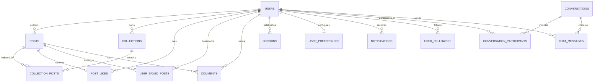

# Database Entity Relationships & Cascading Deletion Semantics

This document details the relational architecture, cardinality, foreign key constraints, and cascading deletion semantics of the Phiny database.

---

## 1. Entity-Relationship Diagram (ERD)



---

## 2. Cardinality & Foreign Key Rules

| Source Entity | Target Entity | Cardinality | Foreign Key Column | On Delete Action |
|---|---|---|---|---|
| `users` | `posts` | 1 : N | `posts.author_id` -> `users.id` | `CASCADE` (Deleting a user removes all their published posts). |
| `users` | `collections` | 1 : N | `collections.owner_id` -> `users.id` | `CASCADE` (Deleting a user deletes all their collections). |
| `collections` | `collection_posts` | 1 : N | `collection_posts.collection_id` -> `collections.id` | `CASCADE` (Deleting a collection removes join entries, leaving original posts intact). |
| `posts` | `collection_posts` | 1 : N | `collection_posts.post_id` -> `posts.id` | `CASCADE` (Deleting a post removes it from all user collections automatically). |
| `users` | `post_likes` | 1 : N | `post_likes.user_id` -> `users.id` | `CASCADE` |
| `posts` | `post_likes` | 1 : N | `post_likes.post_id` -> `posts.id` | `CASCADE` (Deleting a post cleans up all like records). |
| `users` | `user_saved_posts`| 1 : N | `user_saved_posts.user_id` -> `users.id` | `CASCADE` |
| `posts` | `user_saved_posts`| 1 : N | `user_saved_posts.post_id` -> `posts.id` | `CASCADE` (Deleting a post removes it from users' saved library). |
| `posts` | `comments` | 1 : N | `comments.post_id` -> `posts.id` | `CASCADE` (Deleting a post deletes all comments on that post). |
| `users` | `comments` | 1 : N | `comments.user_id` -> `users.id` | `CASCADE` (Deleting a user deletes their comments). |
| `users` | `user_followers` | M : N | `user_followers.follower_id` & `following_id` | `CASCADE` (Deletes follow associations). |
| `conversations` | `conversation_participants` | 1 : N | `conversation_participants.conversation_id` | `CASCADE` |
| `conversations` | `chat_messages` | 1 : N | `chat_messages.conversation_id` | `CASCADE` (Deleting a conversation wipes its message log). |
| `users` | `notifications` | 1 : N | `notifications.recipient_id` -> `users.id` | `CASCADE` |
| `posts` | `notifications` | 1 : N | `notifications.post_id` -> `posts.id` | `CASCADE` (If post is deleted, associated notices are cleaned up). |

---

## 3. Atomic Like and Follow Counter Synchronization

To maintain high read performance on feeds without costly table counts, counter caches (`likes_count` on `posts`, `followers_count` and `following_count` on `users`) should be kept synchronized using database triggers:

```sql
-- Sync post likes count
CREATE OR REPLACE FUNCTION update_post_likes_count()
RETURNS TRIGGER AS $$
BEGIN
    IF TG_OP = 'INSERT' THEN
        UPDATE posts SET likes_count = likes_count + 1 WHERE id = NEW.post_id;
    ELSIF TG_OP = 'DELETE' THEN
        UPDATE posts SET likes_count = GREATEST(0, likes_count - 1) WHERE id = OLD.post_id;
    END IF;
    RETURN NULL;
END;
$$ LANGUAGE plpgsql;

CREATE TRIGGER trg_sync_post_likes
AFTER INSERT OR DELETE ON post_likes
FOR EACH ROW EXECUTE FUNCTION update_post_likes_count();

-- Sync user followers count
CREATE OR REPLACE FUNCTION update_user_follower_counts()
RETURNS TRIGGER AS $$
BEGIN
    IF TG_OP = 'INSERT' THEN
        UPDATE users SET followers_count = followers_count + 1 WHERE id = NEW.following_id;
        UPDATE users SET following_count = following_count + 1 WHERE id = NEW.follower_id;
    ELSIF TG_OP = 'DELETE' THEN
        UPDATE users SET followers_count = GREATEST(0, followers_count - 1) WHERE id = OLD.following_id;
        UPDATE users SET following_count = GREATEST(0, following_count - 1) WHERE id = OLD.follower_id;
    END IF;
    RETURN NULL;
END;
$$ LANGUAGE plpgsql;

CREATE TRIGGER trg_sync_user_followers
AFTER INSERT OR DELETE ON user_followers
FOR EACH ROW EXECUTE FUNCTION update_user_follower_counts();
```
