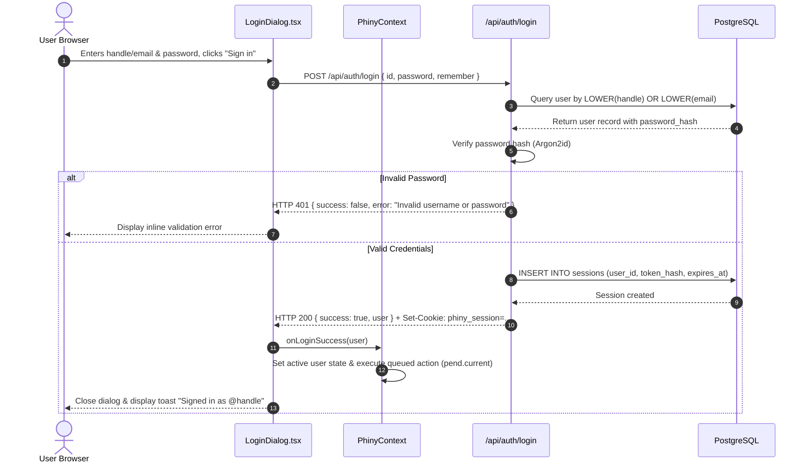
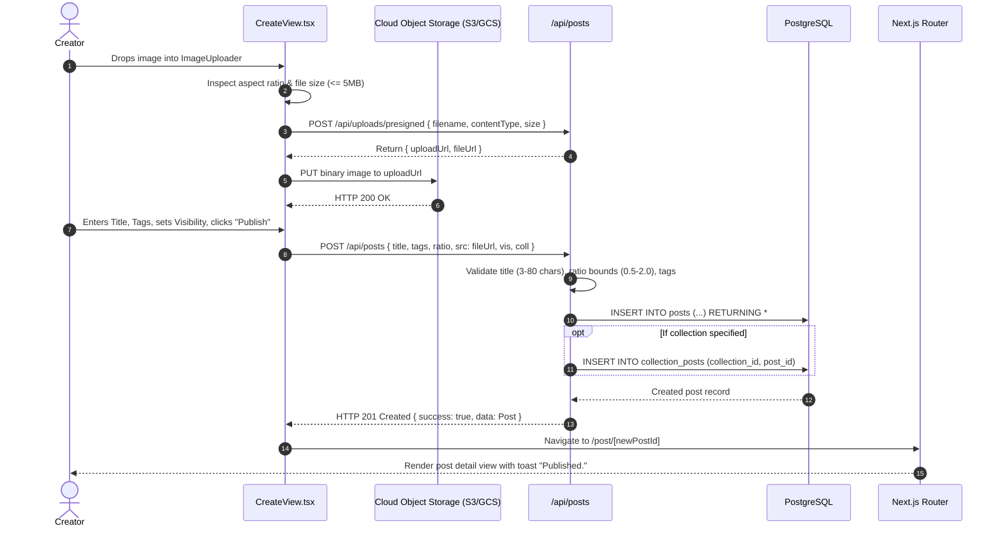
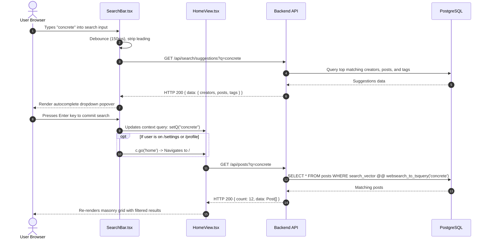
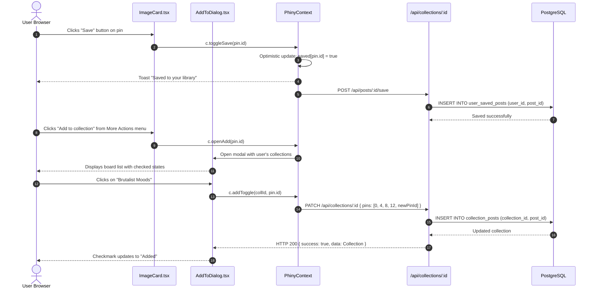
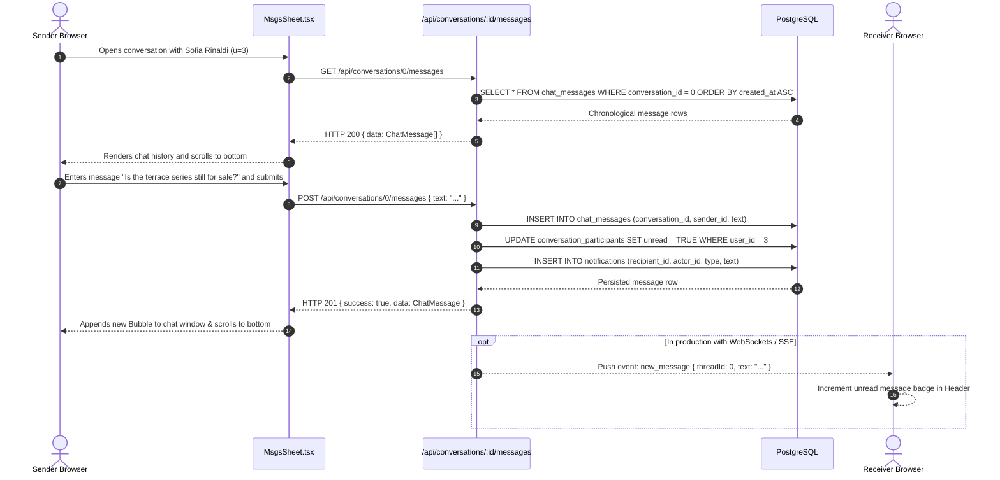
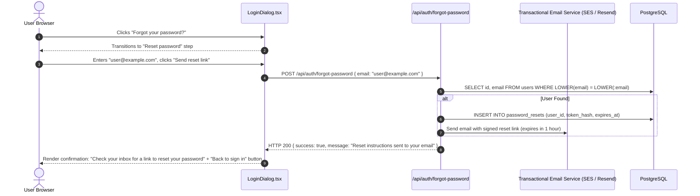

# Frontend ↔ Backend Sequence Diagrams

This document contains Mermaid sequence diagrams illustrating the end-to-end communication flows between the user browser, Next.js frontend, API services, and database.

---

## 1. Authentication: Login Flow

---

## 2. Publish New Post Flow

---

## 3. Global Search Flow

---

## 4. Bookmark / Save Post to Collection Flow

---

## 5. Direct Messaging Flow

---

## 6. Forgot Password Recovery Flow

